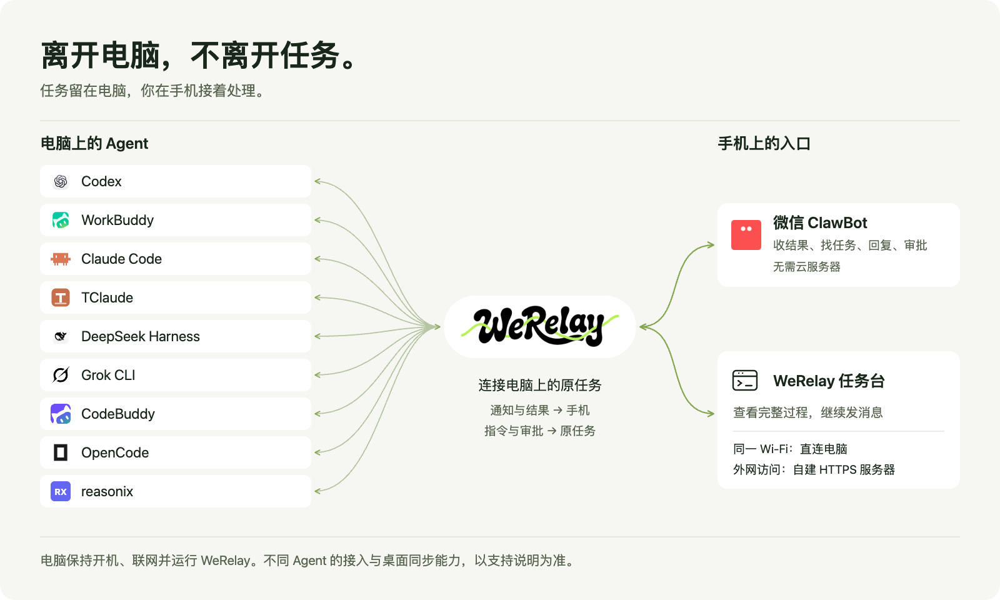

<p align="center"><a href="https://werelay.sinolin.com/"></a></p>

<h1 align="center">离开电脑，不离开任务。</h1>

<p align="center"><strong>SAME AGENT. SAME THREAD. ANYWHERE.</strong><br>同一个搭档，同一段对话，随处接着来。</p>

<p align="center"><a href="https://werelay.sinolin.com/">官网与交互演示 ↗</a> · <a href="#快速开始">开始使用</a> · <a href="docs/README.md">使用文档</a></p>

<p align="center">
  <a href="https://github.com/imsinolam/WeRelay"></a>
  
</p>

电脑上的 Agent 继续工作，你在微信看结果、补充要求、处理审批。需要看完整过程、代码和图片时，打开 **WeRelay 任务台**，接着同一条任务往下做。

**电脑需保持开机、联网并运行 WeRelay。** 各 Agent 的接入与桌面同步范围见[支持说明](#支持的-agent-与会话一致性)。

## 接力如何发生

<p align="center"></p>

- **收到结果**：任务完成，微信告诉你是哪件事、做了什么。
- **找到任务**：发送「任务」查看列表，用「任务：关键词」搜索。
- **继续安排**：发送「序号：内容」，把要求送回对应任务。
- **处理审批**：按通知里的选项回复数字，允许或拒绝这次操作。

任务、项目和上下文仍在电脑上的原 Agent 中，手机只是换一个入口。[查看官网演示](https://werelay.sinolin.com/)。

## 快速开始

先安装并登录至少一个支持的 Agent。需要 Node.js **24 或以上**及 Git；WeRelay 从本仓库获取，不发布到 npm Registry。

可以把下面这段交给你的 Agent：

> 请根据 https://github.com/imsinolam/WeRelay 的最新 README 和安装文档，帮我安装并配置 WeRelay，连接电脑上的 Agent 与微信 ClawBot。先检查环境和现有服务，不覆盖我的配置；完成配对后，用一条示例任务验证：手机消息回到电脑上的原任务，并能收到完成通知。先使用微信和同一 Wi-Fi 下的任务台，暂不配置公网服务器。

<details>
<summary>自己安装：展开命令</summary>

```bash
git clone https://github.com/imsinolam/WeRelay.git
cd WeRelay
npm ci
PACKAGE_FILE="$(npm pack --silent)"
npm install -g "./$PACKAGE_FILE"
werelay-setup
cd /path/to/your/project
werelay --adapter codex
# 常驻后台、不自动恢复终端或打开桌面应用：werelay --idle-start --no-open
```

仓库用 npm 构建和安装本地 tarball，npm 不是公开下载渠道。Windows PowerShell 与更新步骤见[从 GitHub 安装与更新](docs/使用指南/GitHub源码安装与更新.md)。

</details>

扫码连接微信后，向 ClawBot 发送「任务」。进入任务，再发送「状态」，即可从返回的授权链接打开任务台、设置首次访问密码；终端基础地址不用于首次设置密码。

后台启动不会自行打开 ChatGPT 或 WorkBuddy；手动选择对应终端或任务时，可以按需打开。需要启动时自动打开桌面应用才使用 `--open-desktop-apps`。

[Agent 安装与配置](docs/使用指南/Agent安装与配置.md) · [局域网任务台快速开始](docs/使用指南/局域网移动网页快速开始.md)

## 支持的 Agent 与会话一致性

不同 Agent 的接入方式不同。下面分别说明：

- **继续原任务**：选择已有任务后，手机消息进入同一个任务 ID 和上下文；
- **电脑端可见**：手机消息和 Agent 回复能在对应的电脑界面或可见终端中看到；
- **实时同步**：电脑端已经打开该任务时，无须重新加载就能看到远程变化。

| Agent | 继续原任务 | 电脑端可见 | 当前边界 |
| --- | --- | --- | --- |
| Codex Desktop | 是 | 是，原 Codex 任务实时同步 | 完整桌面端接入 |
| WorkBuddy Desktop | 是 | 是，原 WorkBuddy 任务实时同步 | 完整桌面端接入 |
| Claude Code / TClaude | 是，同一 CLI 会话 | 是，在 WeRelay 连接的可见终端中 | 不会自动接管任意一个已经独立打开的终端窗口 |
| OpenCode | 是，同一 OpenCode session | 是，在 WeRelay 连接的 OpenCode 客户端中 | 通过本机 server + attach 共享会话 |
| Grok CLI | 是，同一个 Grok leader 会话 | 是，WeRelay 打开的 Grok 终端实时同步 | 电脑 TUI 和远程入口连接同一个共享 leader |
| CodeBuddy | 是，同一 CodeBuddy `--serve` 任务 | 是，WeRelay 打开的 CodeBuddy 界面实时同步 | 可见界面与 HTTP ACP 共用一个 `--serve` owner，不启动独立 `--acp` |
| reasonix | 是，直接恢复原 transcript | 是，官方 reasonix Web UI 与远程入口实时同步 | 使用 `serve -resume` 打开原文件，不复制或转换历史 |
| DeepSeek Harness | 是，同一 Harness session | 是，当前 `dsh web` 页面实时同步 | 连接本机 Harness Host API，不启动第二个 headless Harness；内部 reasoning 不发送到网页或微信 |

Shell 只是可选的命令执行适配器，不是有任务历史的 Agent，因此不列入会话支持范围。

WeRelay 不包含这些 Agent、模型或账号，请先安装并登录。未连接到 WeRelay 的独立窗口，不保证能被接管或实时同步。

## 哪些场景需要服务器？

| 你想做什么 | 是否需要云服务器 |
| --- | --- |
| 在外面用微信收结果、回复、审批 | **不需要** |
| 手机与电脑在同一可互访的 Wi-Fi，打开任务台 | **不需要** |
| 不在同一个网络，也要打开任务台 | **需要**自建服务器、域名、HTTPS 和访问认证 |

只有外网任务台需要服务器，Agent 仍在电脑上运行，购买服务器不意味着电脑可以关机。公网 Relay 只中继任务消息、状态、审批和附件，不运行第二个 Agent，也不开放任意电脑端口。

可以购买服务器后，让 Agent 按[公网 Relay 配置与验收](docs/使用指南/公网Relay配置与验收.md)协助配置；同网使用见[局域网任务台快速开始](docs/使用指南/局域网移动网页快速开始.md)。

## 当前版本

公开版本：**0.3.13**（2026 年 9 月 22 日）。本次更新 Logo、关系图与首页说明，不改变软件版本。

- 网页更清楚地显示发送、终端接收、运行与完成状态。
- 新建任务前可以确认模型与推理设置。
- 微信、任务列表与 DeepSeek Harness 的连接恢复更加稳定。

[完整更新记录与已知限制](docs/发布/版本记录/0.3.13.md)

<details>
<summary>旧版 DeskRelay 用户的迁移说明</summary>

WeRelay 是一次完整品牌迁移：本地安装包标识改为 `werelay`，公开命令改为 `werelay-*`，活动数据目录改为 `~/.werelay`，环境变量改为 `WERELAY_*`。

旧的 `deskrelay-*` 命令和 `DESKRELAY_*` 环境变量不再作为公开兼容入口。首次启动时，WeRelay 会优先从 `~/.deskrelay` 复制缺失的登录、任务和附件状态，再从更早的 `~/.cli-bridge` 补齐；旧目录不会被删除或继续写入。本机源码目录或旧 worktree 仍叫 `DeskRelay`，不代表产品名或版本线没有迁移。用户迁移步骤见 [运行配置](docs/使用指南/运行配置.md#from-deskrelay-to-werelay)，开发与发布 Agent 见 [名称与版本边界](docs/开发协作/更名与版本边界.md)。


</details>

## 文档

- [完整文档导航](docs/README.md)
- [多 Agent 协作规范](docs/开发协作/多Agent协作规范.md)
- [项目定位](docs/使用指南/项目介绍.md)
- [Agent 安装与配置](docs/使用指南/Agent安装与配置.md)
- [架构与数据流](docs/架构设计/架构与数据流.md)
- [运行配置与品牌迁移](docs/使用指南/运行配置.md)
- [局域网移动网页快速开始](docs/使用指南/局域网移动网页快速开始.md)
- [局域网与公网访问](docs/架构设计/局域网与公网访问.md)
- [公网 Relay Agent 配置与验收](docs/使用指南/公网Relay配置与验收.md)
- [问题排查](docs/使用指南/问题排查.md)
- [开发与测试](docs/开发协作/开发与测试.md)
- [安全说明](SECURITY.md)
- [对外发布](docs/发布/对外发布操作手册.md)

## 安全边界

- 不要公开 `~/.werelay`、登录凭据、设备密钥、移动访问链接、日志或附件；
- 不要使用通用公网隧道把本机端口直接暴露到互联网；
- 公网 Relay 必须使用 HTTPS、长随机设备密钥、访问认证、请求去重和过期控制；
- 当前私有开发仓库可能含历史隐私，公开前必须从审计后的文件快照创建干净 Git 历史。

## License

[AGPL-3.0-or-later](LICENSE.txt)
